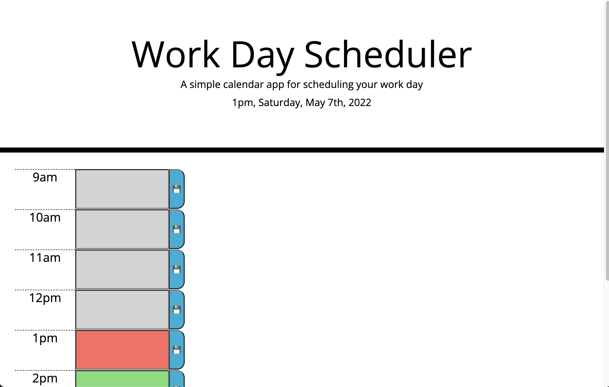

# Work Day Scheduler

## Summary

This page allows you to input text into timeblocks and save that text into the localstorage.

This page was built dynamically using js. It loops through the workday hours and creates the appropriate elements and assignes them time IDs. 

Layout is utilizing bootstrap.

Tools utilized:
- bootstrap
- jquery
- moment.js

## Demo Page
- https://chicken1991.github.io/workday-scheduler/

## Repo
- https://github.com/chicken1991/workday-scheduler.git

